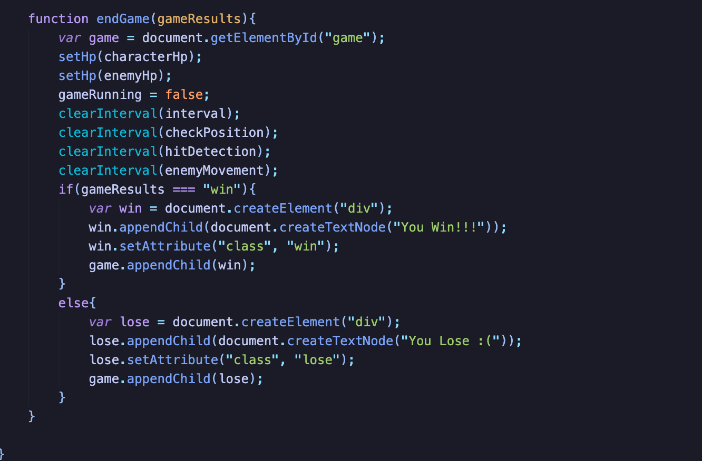

# emoticons-game

## Description 

[Deployed Link](https://hondahelix.github.io/emoticons-game/)

I wanted to practice my vanilla javascript abilities as well as practice CSS positioning. The way I went about this was by creating a simple 2D fighting game.  This project does not use any npm packages or CSS libraries. I also did not use HTML canvas for this project.

The user can control the character and can jump, move left and right, and at an attack. 

1. I wanted to character to be able to move left and right.

2. I wanted to character to be able to jump.

3. I wanted to character to be able to attack.

4. I wanted to character to have hit points.

5. I wanted an enemy that moves.

6. I wanted hit detection.

7. I wanted to have show if the user lost or won.

## Table of Contents
* [Installation](#installation)
* [Usage](#usage)
* [Credits](#credits)
* [License](#license)
   
## Installation

## Usage 

The usage of this project is to have a fun little fighting game. The user can control the character on the left. The controls are: A key to move left, D key to move right, W key to jump, and the spacebar key to attack. The character will attack in the direction that they were last moving. Have fun!!

   
## Credits

The resource that I looked at to get me started was a youtube video that made a simplified version of Google's dinosaur game. [youtube link](https://youtu.be/bG2BmmYr9NQ)

The emoticons I used off of the website [emoticons](http://japaneseemoticons.me)

## License

 MIT

## Badges

## Contact

[My Github](https://github.com/hondahelix) 

[My portfolio](https://hondahelix.github.io/react-portfolio/)
